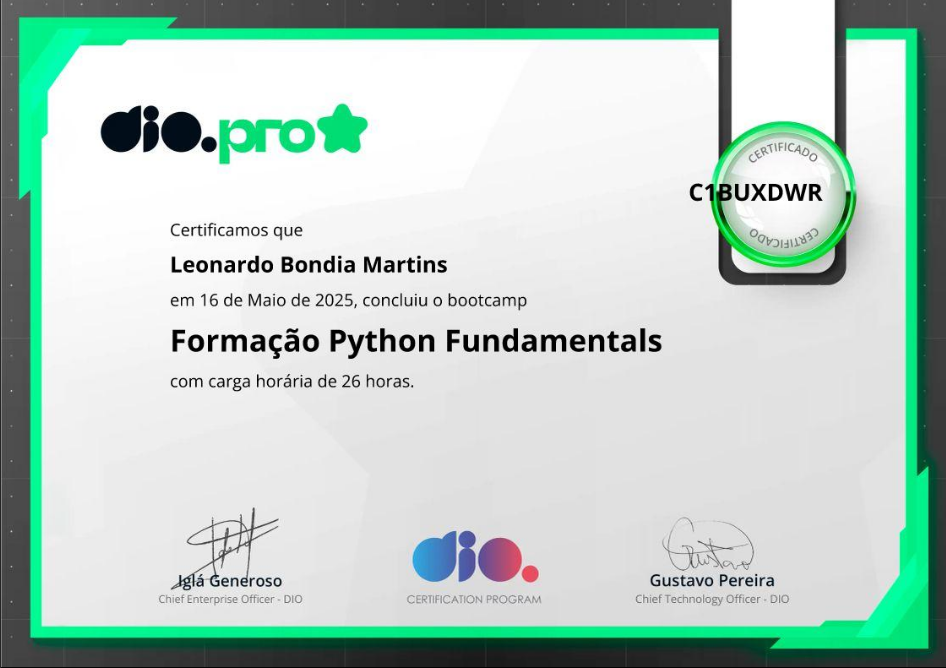

# 🐍 Desafios Python - Módulos I ao IV

Este repositório contém desafios resolvidos em Python como parte da trilha de Python Fundamentals DIO. Os desafios foram desenvolvis com foco em lógica de programação, manipulação de dados e conceitos de programação orientada a objetos. Todos os desafios são executados via terminal (CLI).

---
## 🛠 Tecnologias
- Python 3

## 📘 Módulo I

### 🗓️ 'ano_bissexto.py'
Solicita ao usuário um ano e verifica se o ano informado é bissexto, exibindo "SIM" ou "NÃO" como resposta. 

---

### 🔠 'conta_vogais.py'
Conta o número de vogais em uma string informada pelo usuário e retorna uma mensagem informando o númerode vogais na string.

---

## 📗 Módulo II

### 🔡 'contar_caracteres.py'
Conta a frequência de cada caractere em uma string fornecida e retorna um dicionário com  os resultados.
 
 ### 🔁 'elementos_comuns.py'
 Recebe duas listas de númerosem forma de string, faza conversão para int e identifica os elementos que existem em ambas. 
---

## 📙 Módulo III

### 🧮 'calculadora_classe.py'
Define uma classe Calculadora com um método para somar doisnúmeros inteiros fornecidos pelo usuário. 

### 👤 'classe_pessoa.py'
Define uma classe Pessoa, armazenando {nome}, {idade} e retornando essas informações.

### 🌡️ 'conversor_temperatura.py'
Define a classe **ConversorTemperatura** com o método para converter Celsius para Fahrenheit. 
 

 ## 👨‍💻 Resolvido por Leonardo Martins.
 [LinkedIn](www.linkedin.com/in/leonardo-bondia-1338242b4) • [GitHub](https://github.com/LeonardoBondia)

 ## 🏅 Certificado

 

 